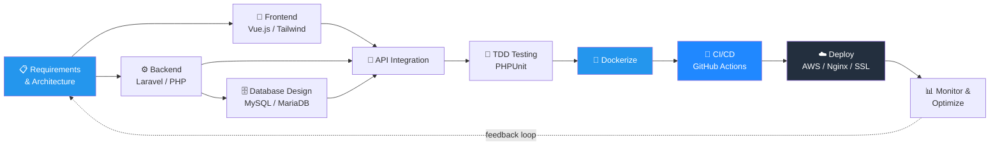
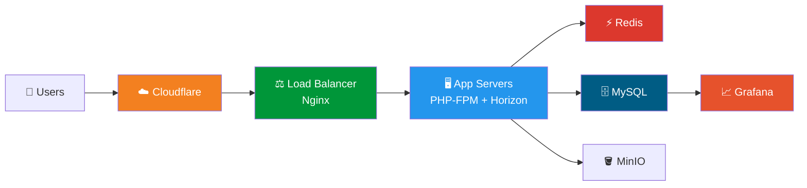
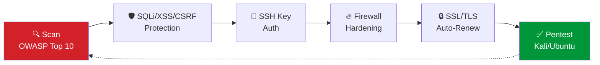

<div align="center">


<p>
  <a href="https://programmermunna.github.io"></a>
  <a href="mailto:programmermunna@gmail.com"></a>
  <a href="https://linkedin.com/in/programmermunna"></a>
</p>


</div>

## 👨‍💻 About Me

> Results-driven **Fullstack Web Developer** and **DevOps Engineer** who turns complex business challenges into scalable, secure, production-grade systems — from the database layer up to the reverse proxy.

```
⚡ Focus Areas     : Scalable Web Architectures · CI/CD Automation · Security & Performance
🧪 Engineering     : Test-Driven Development (TDD) · Clean Code · Query & Index Optimization
🏗️ Specialty       : Multi-Tenant SaaS · Multi-VM Proxmox/Docker Infrastructure
```

## 🧭 How I Build Software — End-to-End Flow



## 🏗️ Typical SaaS Infrastructure I Design



## 🛡️ Security & Hardening Workflow



## 🛠️ Tech Stack & Arsenal

<div align="center">

**Languages & Frameworks**


**Frontend & Styling**


**Infrastructure & DevOps**


**Databases & Cache**


</div>

## 📊 Skill Proficiency

```
Laravel / PHP           ████████████████████████████████████████░░  95%
Linux Server Admin       ██████████████████████████████████████░░░░  90%
Docker & DevOps          █████████████████████████████████████░░░░░  88%
MySQL / Query Tuning     ███████████████████████████████████░░░░░░░  85%
Vue.js / Frontend        ██████████████████████████████████░░░░░░░░  80%
Python Automation        ████████████████████████████████░░░░░░░░░░  75%
```

## 🌟 Featured Projects

<div align="center">

| Project | Highlights | Stack |
| :--- | :--- | :--- |
| 🏢 **KormozoneIT** | IT & digital solutions platform — client project management & agency workflows | `Laravel` `Vue.js` `Tailwind` `MySQL` |
| 🛒 **SaaS E-Commerce Platform** | Multi-tenant architecture with custom storefronts & subscriptions | `Laravel` `Multi-Tenancy` `Vue.js` `SSLCommerz` |
| 🤖 **Social Automation Tools** | Automated publishing & engagement tracking workflow engine | `Python` `REST APIs` `Cron Jobs` |
| 🐍 **Python Utility & Security Tools** | CLI tools for scraping, log parsing, and vulnerability scanning | `Python` `Bash` `Linux CLI` |
| 🐔 **Chicknes Platform** | Poultry management: batch tracking, mortality rate, supply chain | `Laravel` `Vue.js` `MySQL` |
| 💳 **Multi-Payment Gateway Package** | Unified PayPal / Stripe / Payoneer / SSLCommerz with webhooks | `PHP` `Laravel` `TDD` |
| 💬 **Real-Time Group Chat Engine** | WebSocket chat with presence detection & message queues | `Laravel WebSockets` `Redis` `Pusher` |
| 📊 **IAS-Compliant ERP System** | Automated ledger postings under International Accounting Standards | `Laravel` `ERPGo` `Queue Workers` |
| 🚀 **DevOps & Infrastructure Suite** | Zero-downtime deploys, reverse-proxy automation, SSL renewal | `AWS` `Docker` `Nginx` `Bash` |

</div>

## 📈 GitHub Metrics

<div align="center">


</div>

## 📫 Connect & Collaborate

<div align="center">

<a href="https://programmermunna.github.io"></a>
<a href="mailto:programmermunna@gmail.com"></a>
<a href="https://linkedin.com/in/programmermunna"></a>
<a href="https://facebook.com/programmermunna"></a>

<i>"Strive to build things that make a difference, not just exist."</i>


</div>
